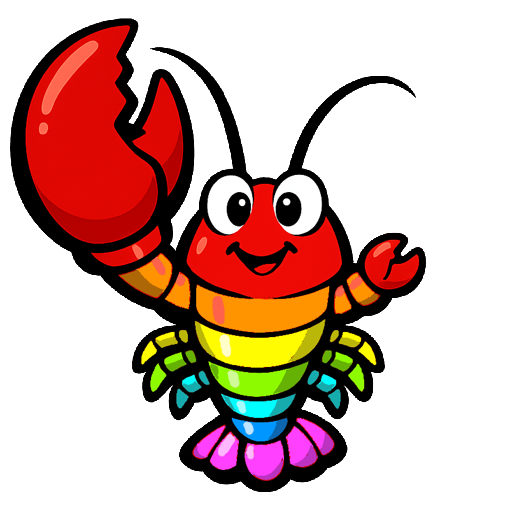

# MiniClaw

**an understandable agent for [Mini Micro](https://miniscript.org/MiniMicro/)**

This project creates an agent, i.e., a software bot that can use multi-step tools in order to carry out extended tasks, similar in principle to OpenClaw or Hermes.  But unlike those, MiniClaw is written in [MiniScript](https://miniscript.org/) and runs within [Mini Micro](https://miniscript.org/MiniMicro/).  This brings two big benefits:

1. The code is small, simple, and easy to understand (even if you don't know MiniScript; the language itself is so simple it has a [1-page quick reference](https://miniscript.org/files/MiniScript-QuickRef.pdf)).

2. Mini Micro is a sandboxed environment -- no matter how the agent goes rogue or what bugs the code might contain, it can't hurt anything on your computer other than, at worst, the agent's own files.

I'll be posting more about this on dev.to soon.  Stay tuned!
